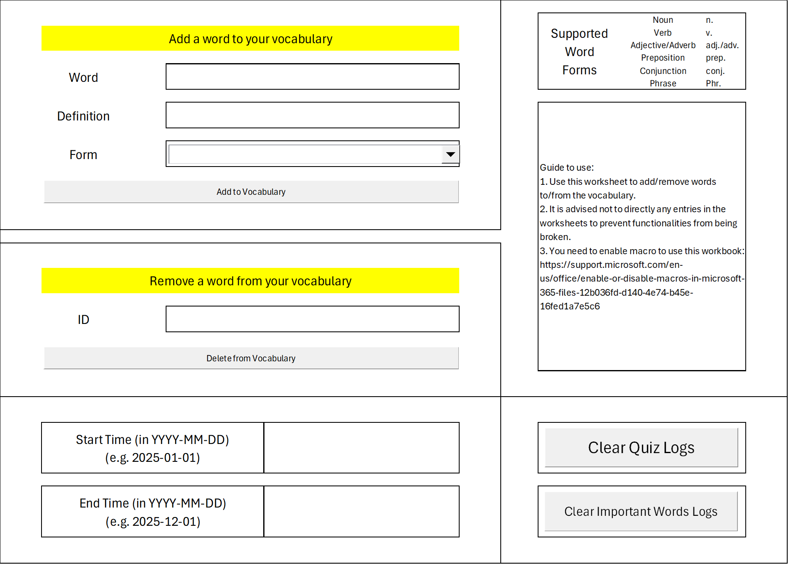
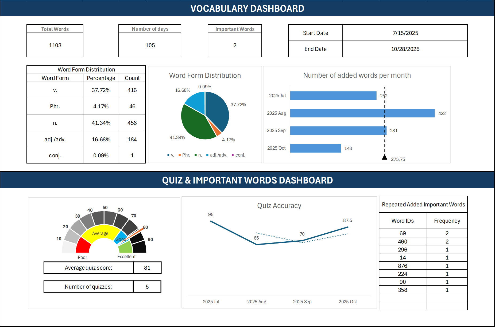

<!--more-->

<!-- # Confessions of an "Idea King" -->

## Why This Workbook?

Learning a new language requires consistent vocabulary practice, but many vocabulary learning tools on the market today are either overcomplicated, require internet connectivity, or lack the flexibility that learners need. This Excel-based vocabulary learning tool was created to address these limitations by offering:

- **Simplicity First**: A straightforward, no-frills interface that focuses on what matters—learning vocabulary. No unnecessary features or overwhelming menus.

- **Core Functionality**: All the essential features you need for effective vocabulary learning in one place:
  - Easy word entry and management
  - Self-testing through randomized quizzes
  - Important word flagging system
  - Progress tracking over time

- **Visual Dashboard**: An at-a-glance visualization of your learning progress, including:
  - Total words learned
  - Word form distribution (nouns, verbs, adjectives, etc.)
  - Quiz performance metrics
  - Learning timeline

- **Offline Access**: Work entirely offline without requiring internet connectivity or third-party accounts.

- **Full Control**: Your vocabulary data stays on your device. No cloud services, no data sharing, no privacy concerns.

- **Customized Language Forms**: You can add additional notations (e.g. verb conjugation/plural form changes in some languages, preposition for verbs, etc.) flexibly to each word.

---

## Getting Started: Access a Clean Workbook

If you'd like to start fresh with an empty workbook (without any sample vocabulary), you can download a clean version [here](https://drive.google.com/file/d/1Moo9CRmupokWSomxsicwW7k9pdU44Y6Q/view?usp=drive_link).

Simply download the file, enable macros when prompted, and you're ready to begin building your personalized vocabulary list.

---

## Workbook Structure Overview

The workbook contains **8 worksheets**, each serving a specific purpose. Some are designed for direct user interaction, while others operate behind the scenes to support the workbook's functionality.

### 📝 **User-Interactive Worksheets** (You should use these)

#### 1. **add_words**
**Purpose**: Your primary interface for adding new vocabulary entries to your collection.

**How to Use**:
- Enter the word in the "Word" field
- Enter the English definition in the "Definition" field
- Select the appropriate word form from the dropdown (n., v., adj./adv., prep., conj., Phr.)
- Click the "Add Word" button (macro-enabled) to save the entry
- The word will automatically be added to your vocab_list with a timestamp
- Remove entered words by entering its ID (**not the row number in Excel!**) in the "ID" field and click on the "Delete from Vocabulary" button
- Clean quiz/important word logs with the corresponding buttons

**Important Notes**:
- You must enable macros for the buttons to work
- The worksheet includes a helpful guide with supported word forms
- All entries are automatically timestamped when added

---

#### 2. **Dashboard**
**Purpose**: Your main visualization hub for tracking learning progress and vocabulary statistics.

**What You'll See**:
- **Summary Statistics**:
  - Total words in your vocabulary
  - Number of days tracked
  - Count of important words flagged
  - Date range of your learning journey

- **Word Form Distribution**:
  - Visual breakdown of vocabulary by type (nouns, verbs, adjectives, etc.)
  - Percentage and count for each word form

- **Quiz Performance Metrics**:
  - Quiz history and accuracy trends
  - Total questions answered
  - Correct answer counts

**How to Use**:
- Simply open this worksheet to view your progress
- The dashboard updates automatically based on your vocabulary entries and quiz results
- Adjust the start and end dates (if needed) to view statistics for specific time periods

**User Interaction**: View only—do not edit cells directly

---

#### 3. **vocab_list**
**Purpose**: The master list of all vocabulary entries you've added.

**What You'll See**:
- ID: Unique identifier for each word
- Word: The German word or phrase
- Definition: English translation
- Form: Grammatical category (n., v., adj./adv., etc.)
- Added On: Timestamp of when the word was added

**How to Use**:
- Browse your complete vocabulary collection
- Sort or filter words as needed
- Review entries for study purposes

**Important**: While you can view and sort this list, it's recommended to add words through the **add_words** worksheet rather than entering them directly here to maintain proper formatting and functionality.

---

#### 4. **quiz**
**Purpose**: A randomized quiz interface for testing your vocabulary knowledge.

**How to Use**:
- Use "Generate Quiz" button to create a quiz from randomly drawn words in your vocab list
- Test yourself by covering the definition column and trying to recall meanings. Reveal the answers with the "Show Answers" button
- Your quiz results can be recorded to track performance over time in the dashboard

**What You'll See**:
- ID, Word, Definition, and Form columns for each quiz question
- Random entries from your vocabulary list

**User Interaction**: Interact only with the buttons on the right.

---

#### 5. **important_words**
**Purpose**: A curated list of vocabulary words you've flagged as important or difficult.

**What You'll See**:
- The same structure as vocab_list (ID, Word, Definition, Form, Added On)
- Only words you've specifically marked as "important"

**How to Use**:
- Review words that require extra attention
- Use this for focused study sessions
- Words can be added or removed from this list using the workbook's macro functions

**User Interaction**: View and study—add/remove through macro buttons

---

### ⚙️ **Backend Worksheets** (Do not edit directly)

#### 6. **quiz_logs**
**Purpose**: Stores historical quiz performance data for tracking learning progress.

**Contains**:
- Quiz Time: Timestamp of each quiz session
- Accuracy: Percentage score
- Total Questions: Number of questions in the quiz
- Correct Answers: Number of correct responses

**Important**: This worksheet feeds data to the Dashboard. Do not modify entries manually to ensure accurate progress tracking.

---

#### 7. **important_words_logs**
**Purpose**: Maintains a history of changes to your important words list.

**Contains**:
- Time: When the word was added or removed
- WordID: Reference to the vocabulary entry
- Operation: Type of change (add/remove)

**Important**: This log helps maintain data integrity. Do not edit manually.

---

#### 8. **dashboard_utils**
**Purpose**: Contains formulas, calculations, and data transformations that power the Dashboard visualizations.

**Contains**:
- Helper formulas for aggregating quiz statistics
- Data processing for word form distributions
- Date calculations and filters

**Critical**: This worksheet is the engine behind the Dashboard. Any manual edits here can break the entire dashboard functionality. Leave it untouched.

---

## Best Practices

### ✅ Do:
- Add all new words through the **add_words** worksheet
- Regularly take quizzes to track your progress
- Review your Dashboard to stay motivated
- Flag challenging words as "important" for focused review
- Enable macros to use the full functionality of the workbook

### ❌ Don't:
- Edit backend worksheets (quiz_logs, important_words_logs, dashboard_utils) directly
- Manually enter data into vocab_list—use the add_words interface instead
- Delete or rename worksheets
- Disable macros unless necessary for security reasons

---

## Troubleshooting

**Problem**: Buttons don't work
- **Solution**: Ensure macros are enabled. Go to File > Options > Trust Center > Trust Center Settings > Macro Settings and select "Enable all macros"

*TBA - Under active maintenance*

---

## Getting Help

For questions about enabling macros in Excel, visit:
[Microsoft Support - Enable or Disable Macros](https://support.microsoft.com/en-us/office/enable-or-disable-macros-in-microsoft-365-files-12b036fd-d140-4e74-b45e-16fed1a7e5c6)

---

**Happy Learning!**
